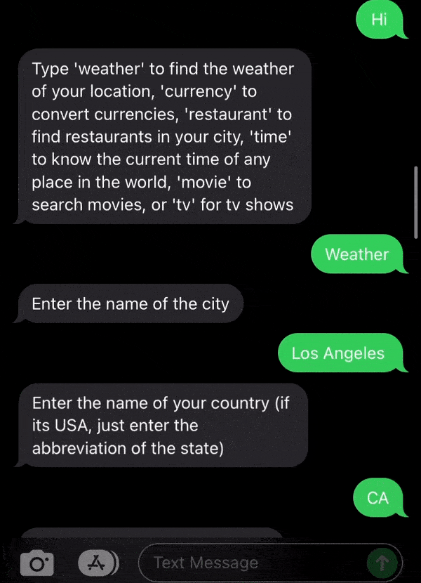

# Twilioapp

This is an SMS twilio application powered by an Express server that utilizes the  Twilio SMS API and number of other APIs to bring you the information of service requested, such as: weather and time of any places, currencies conversion, and details of movies and tv shows. Simply text the number anything to get started with and it will give you the instructions.

## Demo:

 

 

You can try out the application by texting anything to 415-231-0784

## Technologies Used

 Below is a list of some of the technologies used in building the application. 
- [Node](https://nodejs.org/en/) 
- [Express](https://expressjs.com)
- [Twilio API](https://www.twilio.com/docs/usage/api)
- [Openweathermap API](https://openweathermap.org/api)
- [Themoviedb API](https://www.themoviedb.org/documentation/api?language=en-US)
- [Timezonedb API](https://timezonedb.com/api)
- [currconv API](https://www.currencyconverterapi.com/docs)
- [Heroku](https://devcenter.heroku.com/)

## Deployment
Uses heroku to deploy the application in its server

